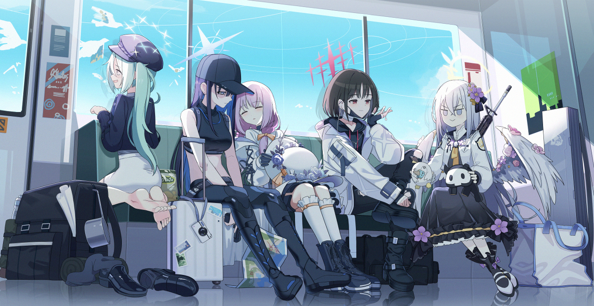

<!--  -->

  

  <!-- pic by <a href="https://x.com/mnnnya">@mnnnya</a> -->
  
    Art by <a href="https://x.com/mnnnya">@mnnnya</a>
  

# Hi 👋, I'm Prxiestza

### 🎓 Computer Science Student | 💻 Developer | 🛡️ Cyber Security Enthusiast

I'm a Computer Science student from Thailand who is interested in programming,  
software development, networking, and cyber security.

- 🌍 Thailand
- 🎓 Computer Science (ComSci)
- 💻 Interested in Software Development
- 🛡️ Interested in Cyber Security & Network Security
- 🚀 Always learning and improving my technical skills

<!--
 -->

---

# My Skills

<table>
<tr>
<td align="center" width="180"><b>Languages</b></td>
<td>

</td>
</tr>

<tr>
<td align="center"><b>Web Development</b></td>
<td>

</td>
</tr>

<tr>
<td align="center"><b>Frameworks</b></td>
<td>

</td>
</tr>

<tr>
<td align="center"><b>Database</b></td>
<td>

</td>
</tr>

<tr>
<td align="center"><b>Tools</b></td>
<td>

</td>
</tr>

<tr>
<td align="center"><b>Interests</b></td>
<td>

🛡️ Cyber Security &nbsp;&nbsp;
🌐 Network Security &nbsp;&nbsp;
💻 Software Development

</td>
</tr>

</table>

---

# 🌐 Contact Me

---

# 📊 GitHub Statistics

---

# 🔥 GitHub Streak

<!--
# 🏆 GitHub Trophies

 -->

<!--
# 💻 Most Used Languages

 -->
---

### 🚀 Keep Learning. Keep Building. Keep Improving.

⭐ Thanks for visiting my profile!

